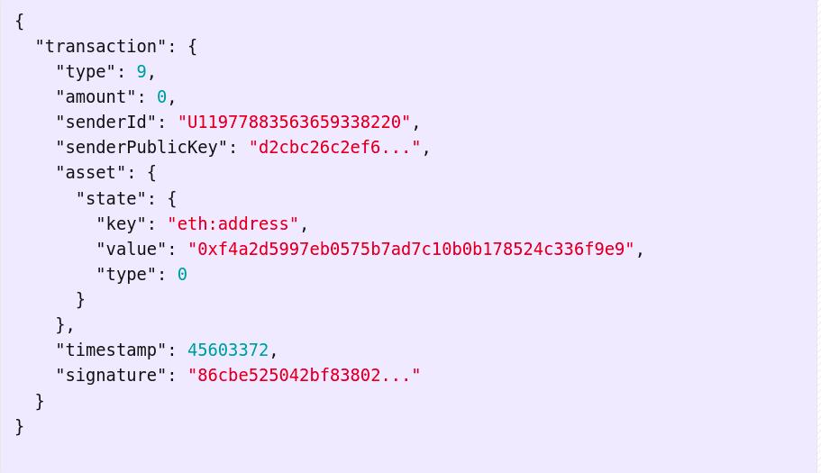
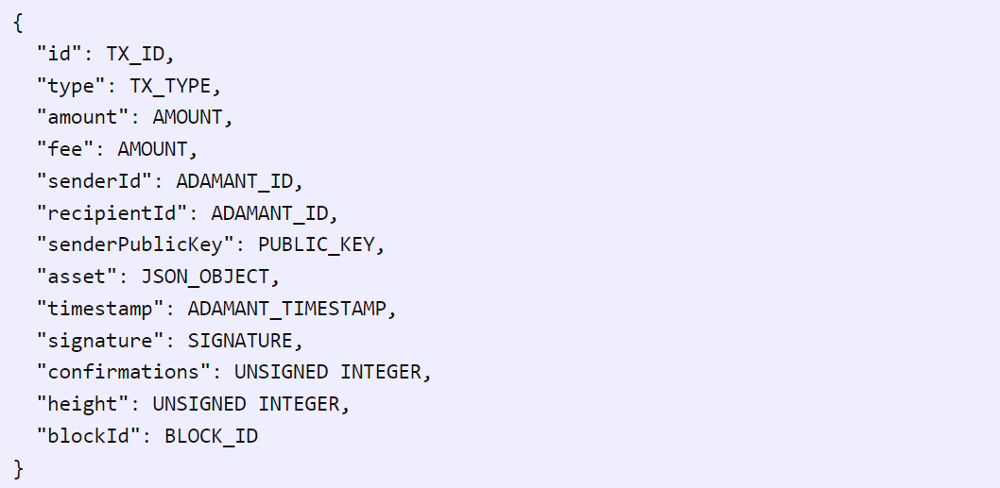
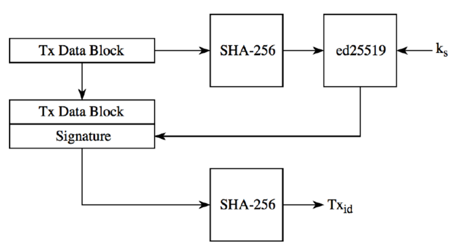

# Rapport Projet SSI : Présentation du chiffrement dans ADAMANT Messenger 

La sécurité est l’une des principales exigences de nos jours, les entreprises s’interrogeant sur des approches innovantes pour protéger les informations. L’une des solutions les plus innovantes qui ont émergé récemment pour aider les entreprises à sécuriser les points d’échange d’informations vers la blockchain. La technologie Blockchain apporte des fonctionnalités de registre distribué et garantit que les parties non autorisées ne peuvent pas voir les informations échangées dans une transaction spécifique.

## Chapitre 1 : Présentation de l'application Adamant.

 
## Chapitre 2 : Le chiffrement dans l'application Adamant.

### Partie 1 : chiffrement des Comptes
**Résumé**

Ce BIP décrit la mise en œuvre d'un code mnémonique ou d'une phrase mnémonique --
un groupe de mots faciles à retenir -- pour la génération de portefeuilles déterministes.

Il se compose de deux parties : générer le mnémonique et le convertir en un
graine binaire. Cette graine peut être utilisée plus tard pour générer des portefeuilles déterministes en utilisant
BIP-0032 ou des méthodes similaires.

**Motivation**

Un code mnémotechnique ou une phrase est supérieur pour l'interaction humaine par rapport au
gestion des représentations binaires ou hexadécimales brutes d'une graine de portefeuille. le
La phrase peut être écrite sur papier ou prononcée au téléphone.

Ce guide est censé être un moyen de transporter le hasard généré par ordinateur avec
une transcription lisible par l'homme. Ce n'est pas un moyen de traiter les créations par l'utilisateur
phrases (également connues sous le nom de brainwallets) dans une graine de portefeuille.

**Génération du mnémonique**

Le mnémonique doit coder l'entropie dans un multiple de 32 bits. Avec plus d'entropie
la sécurité est améliorée mais la durée de la peine augmente. Nous nous référons au
longueur d'entropie initiale comme ENT. La taille autorisée de ENT est de 128 à 256 bits.

Tout d'abord, une entropie initiale de bits ENT est générée. Une somme de contrôle est générée par
prendre le premier 
ORL / ​​.32
bits de son hachage SHA256. Cette somme de contrôle est
ajouté à la fin de l'entropie initiale. Ensuite, ces bits concaténés
sont divisés en groupes de 11 bits, chacun codant un nombre de 0 à 2047, servant
comme index dans une liste de mots. Enfin, nous convertissons ces nombres en mots et
utiliser les mots joints comme une phrase mnémotechnique.

Le tableau suivant décrit la relation entre l'entropie initiale
longueur (ENT), la longueur de la somme de contrôle (CS) et la longueur du mnémonique généré
phrase (MS) en mots.

CS = ORL / ​​32
MS = (ENT + CS) / 11

| ORL | CS | ORL+CS | MS |
|-------|----|--------|------|
| 128 | 4 | 132 | 12 |
| 160 | 5 | 165 | 15 |
| 192 | 6 | 198 | 18 |
| 224 | 7 | 231 | 21 |
| 256 | 8 | 264 | 24 |

**Liste de mots**

Une liste de mots idéale a les caractéristiques suivantes :

a) sélection intelligente de mots
> - la liste de mots est créée de telle manière qu'il suffit de taper les quatre premiers 
  lettres pour identifier sans ambiguïté le mot

b) mots similaires évités
   - des paires de mots comme « construire » et « construire », « femme » et « femmes », ou « rapidement » et « rapidement »
     non seulement rendent la mémorisation de la phrase difficile, mais sont également plus d'erreurs
     sujettes et plus difficiles à deviner

c) listes de mots triées
   - la liste de mots est triée, ce qui permet une recherche plus efficace des mots de code
     (c'est-à-dire que les implémentations peuvent utiliser la recherche binaire au lieu de la recherche linéaire)
   - cela permet également d'utiliser trie (une arborescence de préfixes), par exemple pour une meilleure compression

La liste de mots peut contenir des caractères natifs, mais ils doivent être encodés en UTF-8
en utilisant la décomposition de compatibilité de forme de normalisation (NFKD).
**Listes de mots**

Étant donné que la grande majorité des portefeuilles BIP39 ne prend en charge que la liste de mots anglais,
il est '''fortement déconseillé''' d'utiliser des listes de mots non anglais pour générer
les phrases mnémotechniques.

Si vous pensez toujours que votre application a vraiment besoin d'utiliser une liste de mots localisée,
utilisez l'un des éléments suivants au lieu d'inventer le vôtre.

[Listes des mots](https://github.com/bitcoin/bips/blob/master/bip-0039/bip-0039-wordlists.md)

### Partie 2 : chiffrement des Messages

### 2.2.1 Types Des messages:

#### 2.2.1.1 Basic Encrypted Messages:
Basic Encrypted Message est une simple transaction de message crypté  sous form JSON qui inclut les champs message et own_message.

En plus de l'envoi d'un message, Basic Encrypted Message peut être utilisé pour transférer des Token ADM. Ajoutez un nombre entier de  Tokens ADM dans le champ “amount” de transaction pour effectuer un transfert de Token. Dans ce cas, le champ de message sera utilisé comme commentaire pour le transfert ADM.
Example de l'objet JSON:

#### 2.2.1.2 Rich Content Messages:
Le message de contenu enrichi est une transaction de message de contenu spéciale qui doit être traitée par les applications clientes.

Le champ message de l'objet Rich Content Message doit contenir un JSON crypté de texte enrichi comme l'exemple suivant:

Où type est une chaine de caractère décrivant comment gérer le texte enrichi. Le champ text_fallback est facultatif et il peut être ajouté pour afficher le texte d'explication pour  les applications clients qui ne supportent pas le type de message Rich Content Message. Ce JSON peut avoir d'autres champs autre que ceux, seule le type est obligatoire

Example:

#### 2.2.1.3 Signal Messages:

Le message de signal est un message de transaction spéciale qui doit être masquée par les applications clients, mais traitée par les services interne de l'applications. les messages des notifications par exemple.
Les messages de signal doivent être cryptés de la même manière que Basic Encrypted Messages.

### 2.2.1 Cryptage des messages:

La figure suivante donne une vision sur le cycle de vie d'un message dans l'application Adamant.

* Les messages sont cryptés à l'aide de l'algorithme curve25519 xsalsa20 poly1305 (boîte NaCl). Box est créé à l'aide de la clé privée de l'expéditeur et de la clé publique du destinataire.
* La clé publique du destinataire est récupérée du réseau ADAMANT
* privateKey et publicKey des comptes sont des instances de clés de signature Ed25519, elles doivent donc d'abord être converties en clés Diffie-Hellman Curve25519

#### Example de cryptage

#### Example de décryptage

### Partie 3 : chiffrement dans le Stockage des valeurs-clés KVS

#### 3.1 C'est quoi KVS
Pour l'enregistrement des informations des contacts sur la blockchain, le mécanisme de Stockage Clé-Valeur (KVS) est créé.
 
KVS est un moyen de stocker des informations. Plus concrètement, le stockage clé-valeur (KVS) d'ADAMANT est un type spécial de transactions pour stocker des données privées (cryptées) ou publiques (valeur simple) dans la blockchain d'ADAMANT. Les exemples sont la liste de contacts pour les données privées et l'adresse Ether pour les données publiques.
 
#### 3.2 Structure de la transaction
Entre autres types de transactions, les KVS privées sont stockées dans la blockchain. Elles sont valables pour leurs propriétaires seuls, puisque elles sont encryptées avec une clé privée.

 
- La clé décrit le contenu de l'enregistrement KVS. Elle est sous forme d'une chaîne et obligatoire.
- La valeur est la donnée pour la clé. Elle est aussi obligatoire, le type dépend du contenu.
- Le type indique comment traiter les enregistrements KVS pour cette clé. Il peut s'agir d'une réécriture incrémentielle ou complète des valeurs précédentes. Doit être décrit dans les futurs AIP. Il est un entier, obligatoire. Les transactions KVS sont de type 9.
 
#### 3.3 Algorithmes de cryptage utilisé
1. En ce qui concerne KVS pour chaque partie de l'information d'utilisateur et la donnée:
- Clés de signature Ed25519 de l'utilisateur KVS ⟶ Clé secrète XSalsa20-Poly1305
- Données ⟶ Objet JSON avec «bruit» ajouté.
 
En cryptographie à clé publique, l'algorithme de signature numérique à courbe d'Edwards (EdDA) est un schéma de signature numérique conçu pour être plus rapide que les schémas de signature numérique existants sans sacrifier la sécurité.
 
2. En ce qui concerne la méthode de cryptage:
- XSalsa20-Poly1305 (NaCl.secretbox) chiffrement de 20 tours avec un nonce 192 bits pour Salsa20 et Poly1305 pour vérifier le l'intégrité des données et l'authenticité d'un message.
 
XSalsa20Poly1305 (alias NaCl crypto_secretbox) est une méthode de chiffrement authentifié qui se prête à des implémentations rapides et constantes dans le logiciel, basé sur le chiffrement de flux Salsa20 (avec l'extension XSalsa20 192 bits nonce) et la fonction de hachage universelle Poly1305, qui agit comme une authentification de message code.
Cet algorithme a été largement remplacé par les nouveaux chiffrements AEAD ChaCha20Poly1305 (et les XChaCha20Poly1305) associés (RFC 8439), mais il est utile pour l'interopérabilité avec les anciens protocoles basés sur NaCl.

### Partie 4 :la signature des transactions

#### 4.1 ADAMANT Transaction
Les objets de transaction sont le seul moyen d'écrire des données dans la blockchain ADAMANT.

Toutes les transactions dans la blockchain ADAMANT sont signées avec un algorithme de crypto signation robuste Ed25519 EdDSA

Chaque transaction, quel que soit le type, doit être signée par l'expéditeur avant d'être acceptée par le réseau. Le processus de signature de la transaction est identique pour chaque transaction. 

#### 4.2 Types de transactions
Toute transaction dans ADAMANT a son but et son objet. Bien que toutes les transactions aient une structure générale, il existe certaines particularités entre types.

* 0 est destiné à l'envoi de jetons
* 1 est pour la deuxième signature
* 2 est pour l'inscription des délégués
* 3 est pour le vote
* 4 est pour multisignature
* 8 est destiné à la messagerie (y compris le contenu enrichi) et aux transferts de jetons In-Chat
* 9 est destiné au stockage de données (KVS)

La transaction ADAMANT doit être conforme au schéma JSON :

Les champs suivants doivent être présents dans tous les types de transactions :
* Entier de 8 bits identifiant le type de transaction
* Horodatage d’époque de 32 bits indiquant la date de création de la transaction
* La clé publique 256 bits de l’émetteur de la transaction
* Entier de 64 bits représentant la quantité de jetons à transférer

Les autres champs seront ajoutés à ce schéma en fonction du type de transaction. 

### Le processus de signature de la transaction

Le processus de signature de la transaction est identique pour chaque transaction.

Tout d’abord, un bloc de données représentant la transaction doit être généré. Chaque bloc de données contient un ensemble spécifique d’informations standardisées. Les informations supplémentaires contenues dans le bloc de données diffèrent en fonction du type de transaction.

Une fois le bloc de données généré, il est haché à l’aide de l’algorithme SHA-256, et ce hachage est signé à l’aide de la paire de clés de l’émetteur. 

L’ID de transaction est généré à partir du bloc de données. 

Afin de calculer l’ID de transaction, le système prend le bloc de données avec les informations de signature complétées et hache ce bloc à l’aide de SHA-256 et les 8 premiers octets du hachage sont inversés et qui sont ensuite utilisés comme ID de transaction.

Enfin, une signature de transaction doit être incluse dans l’objet de transaction avant d’être diffusée sur le réseau.

## Chapitre 3 : Simulation d'un noeud dans le blockchain.
